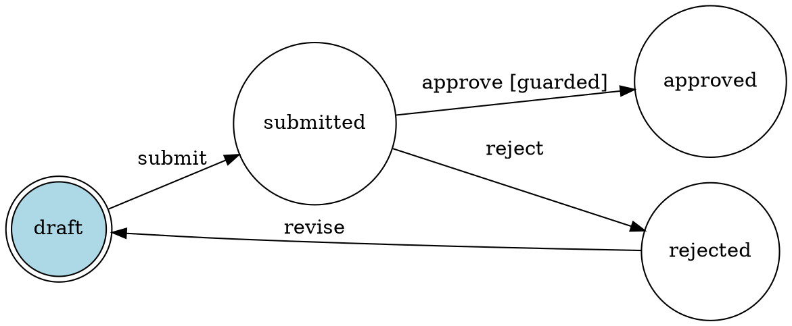

# tramoya

**Finite state machines that fit in your head. Pure Python, production-ready.**  
*Guards · Entry/Exit hooks · Undo history · JSON serialization · Static lint · Graphviz & Mermaid export · Zero dependencies.*

```python
from tramoya import Machine

order = Machine(
    states=["draft", "submitted", "approved", "rejected"],
    transitions=[
        ("submit",  "draft",     "submitted"),
        ("approve", "submitted", "approved",  lambda ctx: ctx.get("score", 0) > 50),
        ("reject",  "submitted", "rejected"),
        ("revise",  "rejected",  "draft"),
    ],
    initial="draft",
)

order.trigger("submit")              # draft → submitted
order.trigger("approve", score=80)   # submitted → approved
order.undo()                         # approved → submitted
```

No classes to inherit. No XML to parse. No framework to learn. Define your machine with lists and tuples, and it works.

---

## Why tramoya?

State machine libraries in Python fall into two traps: either they demand class hierarchies and inheritance rituals for something that should be a dict, or they're so minimal they lack guards, hooks, and serialization — forcing you to reinvent them anyway.

| | tramoya | transitions | python-statemachine |
|---|:---:|:---:|:---:|
| Define with plain tuples/dicts | ✓ | partial | ✗ |
| Guard conditions | ✓ | ✓ | ✓ |
| Entry/exit hooks | ✓ | ✓ | ✓ |
| Transition actions | ✓ | ✓ | ✓ |
| Undo / history | ✓ | ✗ | ✗ |
| JSON snapshot (runtime state) | ✓ | ✗ | ✗ |
| Graphviz DOT + Mermaid export | ✓ | ✓ | ✓ |
| Introspection (can / available) | ✓ | ✓ | partial |
| Static lint (dead edges, unreachable states) | ✓ | ✗ | ✗ |
| No class inheritance required | ✓ | partial | ✗ |
| Dependencies | **0** | 0 | 0 |

**transitions** is the most popular option — battle-tested, with async support, thread-safe variants, and a rich plugin ecosystem. tramoya trades that breadth for simplicity: plain data structures, one file, no class inheritance. If you can write a list of tuples, you can build a state machine.

---

## Install

```bash
pip install tramoya
```

Or just copy `tramoya.py` into your project. It's one file.

**Requires:** Python 3.10+  
**Dependencies:** None (stdlib only)

---

## Quick Start

### The minimum viable machine

```python
from tramoya import Machine

light = Machine(
    states=["off", "on"],
    transitions=[
        ("toggle", "off", "on"),
        ("toggle", "on",  "off"),
    ],
    initial="off",
)

light.trigger("toggle")   # "on"
light.trigger("toggle")   # "off"
print(light.state)         # "off"
```

Three things: states, transitions, initial. That's the entire API surface for basic use.

### Transitions as tuples

Each transition is a tuple with 3 to 5 elements:

```python
# (trigger, source, destination)
("submit", "draft", "submitted")

# (trigger, source, destination, guard)
("approve", "submitted", "approved", lambda ctx: ctx["score"] > 50)

# (trigger, source, destination, guard, action)
("approve", "submitted", "approved", guard_fn, action_fn)
```

---

## Core Features

### Guards — conditional transitions

Guards are functions that receive the context dict and return `True` or `False`. The transition only fires if the guard allows it.

```python
machine = Machine(
    states=["idle", "processing", "approved", "rejected"],
    transitions=[
        ("review", "processing", "approved",  lambda ctx: ctx.get("score", 0) >= 70),
        ("review", "processing", "rejected",  lambda ctx: ctx.get("score", 0) < 70),
    ],
    initial="idle",
)
```

When multiple transitions share the same trigger from the same state, tramoya evaluates guards top-to-bottom and fires the first one that passes:

```python
machine.trigger("review", score=85)   # → approved (first guard passes)
```

If no guard passes, `GuardRejected` is raised.

#### Check before firing

```python
machine.can("review", score=85)   # True — guard would pass
machine.can("review", score=30)   # True — second guard would pass
machine.can("submit")             # False — no "submit" from current state
```

`can()` evaluates guards without side effects. Use it for UI logic (enable/disable buttons, show/hide actions).

### Entry and exit hooks

Run code when entering or leaving a state:

```python
def notify_team(ctx):
    slack.post(f"Order #{ctx['order_id']} approved")

def archive_draft(ctx):
    db.archive(ctx["order_id"])

order = Machine(
    states=["draft", "submitted", "approved"],
    transitions=[
        ("submit",  "draft",     "submitted"),
        ("approve", "submitted", "approved"),
    ],
    initial="draft",
    on_enter={"approved": notify_team},
    on_exit={"draft": archive_draft},
)
```

Execution order on each transition:

```
1. on_exit[old_state](ctx)    — if defined
2. transition.action(ctx)     — if defined
3. state changes
4. on_enter[new_state](ctx)   — if defined
```

### Transition actions

Actions run during the transition itself — after exit, before enter:

```python
def log_approval(ctx):
    audit_log.write(f"Approved by {ctx['approver']} with score {ctx['score']}")

transitions = [
    ("approve", "submitted", "approved", guard_fn, log_approval),
]
```

### Context — shared data across the machine

Every machine carries a `ctx` dict. Keyword arguments passed to `trigger()` merge into it:

```python
machine = Machine(
    states=["new", "active"],
    transitions=[("activate", "new", "active")],
    initial="new",
    ctx={"created_at": "2025-01-01"},
)

machine.trigger("activate", activated_by="admin", plan="pro")

print(machine.ctx)
# {"created_at": "2025-01-01", "activated_by": "admin", "plan": "pro"}
```

Guards, actions, and hooks all receive this merged context.

### Undo — revert to previous state

```python
order = Machine(
    states=["draft", "submitted", "approved"],
    transitions=[
        ("submit",  "draft",     "submitted"),
        ("approve", "submitted", "approved"),
    ],
    initial="draft",
)

order.trigger("submit")    # draft → submitted
order.trigger("approve")   # submitted → approved
order.undo()               # approved → submitted
order.undo()               # submitted → draft
```

Undo restores the previous state and ctx — no hooks or actions fire. History tracks up to 50 states by default (configurable via `history_size`).

```python
machine = Machine(..., history_size=100)   # keep 100 undo steps
machine = Machine(..., history_size=0)     # disable history entirely
```

### Introspection

```python
machine.state                # Current state: "submitted"
machine.available_triggers   # Triggers valid from current state: ["approve", "reject"]
machine.can("approve")       # Would this trigger fire? (evaluates guards)
machine.history              # List of previous states: ["draft"]
```

### Static lint — the machine audits itself

`lint()` analyzes the trigger topology and reports defects that are provable
without running the machine:

```python
m = Machine(
    states=["a", "b", "c"],
    transitions=[
        ("go", "a", "b"),          # unguarded — always wins "go" from "a"
        ("go", "a", "c"),          # DEAD: can never fire
    ],
    initial="a",
)

for f in m.lint():
    print(f.kind, "—", f.message)
# dead_edge — trigger 'go' from 'a' to 'c' can never fire: shadowed by ...
# unreachable_state — state 'c' is not reachable from initial state 'a'
```

Three finding kinds:

| Kind | Severity | Meaning |
|------|----------|---------|
| `dead_edge` | warning | An earlier unguarded edge for the same trigger always wins the dispatch — this edge can provably never fire. `shadowed_by` names the culprit (`None` when a wildcard is dead because every state has its own unguarded explicit edge). |
| `unreachable_state` | warning | No trigger path from `initial` reaches this state (dead edges don't count as paths). |
| `sink_state` | info | Reachable, but no edge leaves it. Opt-in via `lint(include_info=True)` — a dead end is often an intentional final state. |

Guards are treated as opaque (they might return `False` at runtime), so a
guarded edge never shadows anything: **warnings have zero false positives by
design**. The flip side: a guard that always returns `False` is invisible to
the analysis.

`lint()` is pure — it never raises and never mutates the machine. Wire it into
a test and your topology stays honest:

```python
def test_machine_topology_is_clean():
    assert build_my_machine().lint() == []
```

---

## Serialization

### Save to JSON

```python
machine.trigger("submit")
machine.trigger("approve", score=92)

snapshot = machine.to_json()
# '{"state": "approved", "initial": "draft", "ctx": {"score": 92}, "history": [{"state": "draft", "ctx": {}}, {"state": "submitted", "ctx": {}}]}'
```

### Restore from JSON

```python
import json

# Recreate the machine structure (states + transitions stay in code)
machine2 = Machine(
    states=["draft", "submitted", "approved"],
    transitions=[...],
    initial="draft",
)

# Load saved state
machine2.load_dict(json.loads(snapshot))
print(machine2.state)   # "approved"
print(machine2.ctx)     # {"score": 92}
```

The machine definition (states, transitions, guards) lives in code. Only the runtime state (current state, context, history) gets serialized. This is intentional — logic belongs in code, not in JSON.

### Dict format

```python
machine.to_dict()    # {"state": "...", "initial": "...", "ctx": {...}, "history": [{"state": "...", "ctx": {...}}, ...]}
machine.load_dict(d) # Restore from dict
```

Each history entry stores the state AND the ctx to restore on `undo()`. Legacy snapshots — history as a plain list of state names — still load, but they carry no ctx per entry, so `undo()` restores an empty ctx for those entries.

---

## Graphviz Export

Generate DOT format for visualization:

```python
print(machine.to_dot("order_flow"))
```

Output:



Render it with Graphviz, or paste it into [edotor.net](https://edotor.net) or [dreampuf.github.io/GraphvizOnline](https://dreampuf.github.io/GraphvizOnline/) to see your machine as a diagram:

```
          submit            approve [guarded]
 (draft) ──────→ (submitted) ──────────────→ (approved)
    ↑                │
    │  revise        │ reject
    └──── (rejected) ←┘
```

Guarded transitions are labeled so you can spot conditional logic at a glance.

---

## Real-World Examples

### Order processing pipeline

```python
from tramoya import Machine, GuardRejected

order = Machine(
    states=["cart", "checkout", "payment", "confirmed", "shipped", "delivered", "cancelled"],
    transitions=[
        ("checkout",  "cart",       "checkout"),
        ("pay",       "checkout",   "payment"),
        ("confirm",   "payment",    "confirmed",  lambda ctx: ctx.get("paid", False)),
        ("ship",      "confirmed",  "shipped"),
        ("deliver",   "shipped",    "delivered"),
        ("cancel",    "cart",       "cancelled"),
        ("cancel",    "checkout",   "cancelled"),
        ("cancel",    "payment",    "cancelled",  lambda ctx: not ctx.get("paid", False)),
    ],
    initial="cart",
    on_enter={
        "confirmed": lambda ctx: send_confirmation_email(ctx),
        "shipped":   lambda ctx: send_tracking_email(ctx),
        "cancelled": lambda ctx: refund_if_paid(ctx),
    },
)
```

### User authentication flow

```python
auth = Machine(
    states=["anonymous", "logging_in", "authenticated", "locked", "mfa_required"],
    transitions=[
        ("login",       "anonymous",     "logging_in"),
        ("credentials", "logging_in",    "mfa_required",   lambda ctx: ctx.get("mfa_enabled")),
        ("credentials", "logging_in",    "authenticated",  lambda ctx: not ctx.get("mfa_enabled")),
        ("verify_mfa",  "mfa_required",  "authenticated",  lambda ctx: ctx.get("mfa_valid")),
        ("fail_mfa",    "mfa_required",  "locked",         lambda ctx: ctx.get("attempts", 0) >= 3),
        ("logout",      "authenticated", "anonymous"),
        ("unlock",      "locked",        "anonymous"),
    ],
    initial="anonymous",
)

auth.trigger("login")
auth.trigger("credentials", mfa_enabled=True)
print(auth.state)   # "mfa_required"
auth.trigger("verify_mfa", mfa_valid=True)
print(auth.state)   # "authenticated"
```

### Game entity AI

```python
enemy = Machine(
    states=["idle", "patrol", "chase", "attack", "flee", "dead"],
    transitions=[
        ("spot_player",   "idle",    "chase",   lambda ctx: ctx.get("distance", 999) < 100),
        ("spot_player",   "patrol",  "chase",   lambda ctx: ctx.get("distance", 999) < 100),
        ("reach_player",  "chase",   "attack",  lambda ctx: ctx.get("distance", 999) < 10),
        ("lose_player",   "chase",   "patrol"),
        ("low_health",    "attack",  "flee",    lambda ctx: ctx.get("hp", 100) < 20),
        ("low_health",    "chase",   "flee",    lambda ctx: ctx.get("hp", 100) < 20),
        ("safe",          "flee",    "idle"),
        ("die",           "attack",  "dead"),
        ("die",           "flee",    "dead"),
        ("start_patrol",  "idle",    "patrol"),
    ],
    initial="idle",
)

# Game loop
enemy.trigger("start_patrol")
enemy.trigger("spot_player", distance=50)    # patrol → chase
enemy.trigger("reach_player", distance=5)    # chase → attack
enemy.trigger("low_health", hp=10)           # attack → flee
```

### CI/CD pipeline stage tracker

```python
pipeline = Machine(
    states=["queued", "building", "testing", "deploying", "live", "failed", "rolled_back"],
    transitions=[
        ("start",    "queued",     "building"),
        ("build_ok", "building",   "testing"),
        ("test_ok",  "testing",    "deploying",  lambda ctx: ctx.get("coverage", 0) >= 80),
        ("test_fail","testing",    "failed"),
        ("deploy_ok","deploying",  "live"),
        ("deploy_fail","deploying","failed"),
        ("rollback", "live",       "rolled_back"),
        ("rollback", "failed",     "rolled_back"),
        ("retry",    "failed",     "queued"),
    ],
    initial="queued",
    on_enter={
        "live":        lambda ctx: notify_team("Deployed successfully"),
        "failed":      lambda ctx: notify_team(f"Pipeline failed: {ctx.get('reason')}"),
        "rolled_back": lambda ctx: notify_team("Rollback completed"),
    },
)
```

### Document approval workflow with persistence

```python
import json
import redis

r = redis.Redis()

def create_document_machine(doc_id: str) -> Machine:
    machine = Machine(
        states=["draft", "review", "approved", "published", "archived"],
        transitions=[
            ("submit",   "draft",    "review"),
            ("approve",  "review",   "approved",  lambda ctx: ctx.get("reviewer") != ctx.get("author")),
            ("reject",   "review",   "draft"),
            ("publish",  "approved", "published"),
            ("archive",  "published","archived"),
            ("revise",   "approved", "draft"),
        ],
        initial="draft",
        ctx={"doc_id": doc_id},
    )

    # Load persisted state if exists
    saved = r.get(f"doc:{doc_id}:state")
    if saved:
        machine.load_dict(json.loads(saved))

    return machine

def save_machine(machine: Machine):
    doc_id = machine.ctx["doc_id"]
    r.set(f"doc:{doc_id}:state", machine.to_json())

# Usage
doc = create_document_machine("DOC-42")
doc.trigger("submit", author="alice")
doc.trigger("approve", reviewer="bob")
save_machine(doc)
```

---

## API Reference

### `Machine(states, transitions, initial, **kwargs)`

| Parameter | Type | Default | Description |
|-----------|------|---------|-------------|
| `states` | `list[str]` | required | All valid state names |
| `transitions` | `list[tuple]` | required | `(trigger, source, dest [, guard] [, action])` |
| `initial` | `str` | required | Starting state |
| `on_enter` | `dict[str, callable]` | `{}` | `{state: fn(ctx)}` — run when entering |
| `on_exit` | `dict[str, callable]` | `{}` | `{state: fn(ctx)}` — run when leaving |
| `ctx` | `dict` | `{}` | Shared context carried through the machine |
| `history_size` | `int` | `50` | Max undo steps (0 to disable) |
| `shallow_ctx` | `bool` | `False` | Snapshot ctx with `dict()` instead of `deepcopy()`: 10-50× faster, nested values unprotected |
| `on_transition` | `callable` | `None` | Global `callback(trigger, src, dst, ctx)` after every transition |

### Methods

| Method | Returns | Description |
|--------|---------|-------------|
| `trigger(name, **kwargs)` | `str` | Fire a trigger. Returns new state. |
| `transition_to(dest, **kwargs)` | `str` | Imperative dispatch: fire whichever trigger leads to `dest` from the current state. Returns new state. |
| `trigger_many(*triggers)` | `str` | Fire several triggers in sequence; each is a name or a `(name, kwargs)` tuple. Not atomic. Returns the final state. |
| `can(trigger, **kwargs)` | `bool` | Check if trigger would fire (evaluates guards). |
| `is_stuck(**kwargs)` | `bool` | True if no available trigger can actually fire (evaluates guards). |
| `undo()` | `str` | Revert to previous state and ctx. |
| `reset(state=None, clear_ctx=True)` | `None` | Reset to a state (default: initial). Clears ctx by default. |
| `subscribe(callback)` | `callable` | Add an observer `callback(trigger, src, dst, ctx)`, run after each committed transition. Returns the callback. |
| `unsubscribe(callback)` | `None` | Remove an observer (no-op if it is not subscribed). |
| `to_dict()` | `dict` | Serialize runtime state. |
| `load_dict(data)` | `None` | Restore runtime state. |
| `to_json()` | `str` | Serialize to JSON string. |
| `from_dict(states, transitions, data, **kwargs)` | `Machine` | Classmethod: rebuild a machine from `to_dict()` output. `kwargs` go to the constructor. |
| `from_json(states, transitions, json_str, **kwargs)` | `Machine` | Classmethod: same, from a JSON string. |
| `to_dot(title)` | `str` | Export to Graphviz DOT format. |
| `to_mermaid()` | `str` | Export to Mermaid `stateDiagram-v2`. |
| `lint(include_info=False)` | `list[LintFinding]` | Static topology analysis: dead edges, unreachable states, sinks. Pure, never raises. |

### Properties

| Property | Type | Description |
|----------|------|-------------|
| `state` | `str` | Current state |
| `initial` | `str` | Initial state (where `reset()` returns by default) |
| `states` | `set[str]` | Declared state names (a copy) |
| `history` | `list[str]` | Previous states (for undo) |
| `is_final` | `bool` | No trigger is available from the current state (ignores guards) |
| `available_triggers` | `list[str]` | Triggers valid from current state |
| `ctx` | `dict` | Shared context dict |

### Exceptions

| Exception | When | Parent |
|-----------|------|--------|
| `MachineError` | Base error for all machine errors | `Exception` |
| `InvalidTransition` | Trigger has no path from current state | `MachineError` |
| `GuardRejected` | All guards for this trigger returned False | `MachineError` |

---

## Design Decisions

**Why tuples instead of a DSL?**  
Tuples are data. You can generate them, load them from config files, compose them at runtime. A DSL is opaque — you can't loop over it, filter it, or merge two sets of transitions programmatically.

**Why no class inheritance?**  
Inheritance couples your domain objects to the FSM library. With tramoya, the machine is a standalone object you compose into your architecture however you want — attribute, dependency injection, function argument.

**Why separate `on_enter`/`on_exit` from transition actions?**  
Enter/exit hooks are about the *state*. Actions are about the *transition*. "Send email when entering `approved`" should fire regardless of *how* you got there. "Log who approved it" is specific to the approval transition.

**Why no async?**
tramoya is synchronous-only. If your guards or hooks need to call async functions, wrap them with `asyncio.run()` or schedule them on your event loop. A native `AsyncMachine` may come in a future version.

---

## FAQ

**Q: Why "tramoya"?**
A: Spanish for the backstage machinery in a theater — the hidden mechanism that makes everything move. Because that's what a state machine is.

**Q: Can I just copy the file instead of pip install?**  
A: Yes. One file, zero deps. Copy and go.

**Q: Can I have the same trigger from multiple states?**  
A: Yes. Define multiple tuples with the same trigger name but different sources:

```python
transitions=[
    ("cancel", "cart",     "cancelled"),
    ("cancel", "checkout", "cancelled"),
    ("cancel", "payment",  "cancelled"),
]
```

**Q: Can I have multiple transitions from the same state with the same trigger?**  
A: Yes — use guards to differentiate:

```python
transitions=[
    ("review", "submitted", "approved", lambda ctx: ctx["score"] >= 70),
    ("review", "submitted", "rejected", lambda ctx: ctx["score"] < 70),
]
```

The first guard that passes wins.

**Q: Is it thread-safe?**  
A: No. The Machine class is not thread-safe by design — state machines are typically owned by a single flow of execution. If you need thread safety, wrap `trigger()` calls with a lock.

**Q: What Python versions?**  
A: 3.10+ (uses `Union` type syntax from `__future__` annotations).

---

## License

MIT — do whatever you want.

```
Copyright 2025

Permission is hereby granted, free of charge, to any person obtaining a copy
of this software and associated documentation files (the "Software"), to deal
in the Software without restriction, including without limitation the rights
to use, copy, modify, merge, publish, distribute, sublicense, and/or sell
copies of the Software, and to permit persons to whom the Software is
furnished to do so, subject to the following conditions:

The above copyright notice and this permission notice shall be included in
all copies or substantial portions of the Software.

THE SOFTWARE IS PROVIDED "AS IS", WITHOUT WARRANTY OF ANY KIND, EXPRESS OR
IMPLIED, INCLUDING BUT NOT LIMITED TO THE WARRANTIES OF MERCHANTABILITY,
FITNESS FOR A PARTICULAR PURPOSE AND NONINFRINGEMENT. IN NO EVENT SHALL THE
AUTHORS OR COPYRIGHT HOLDERS BE LIABLE FOR ANY CLAIM, DAMAGES OR OTHER
LIABILITY, WHETHER IN AN ACTION OF CONTRACT, TORT OR OTHERWISE, ARISING FROM,
OUT OF OR IN CONNECTION WITH THE SOFTWARE OR THE USE OR OTHER DEALINGS IN
THE SOFTWARE.
```
